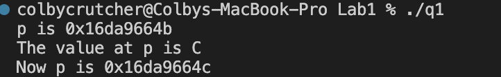
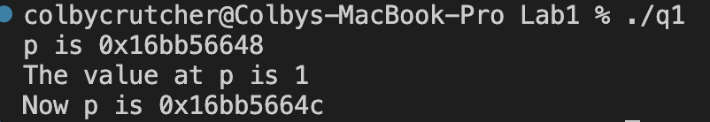
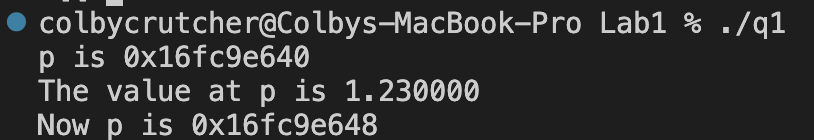
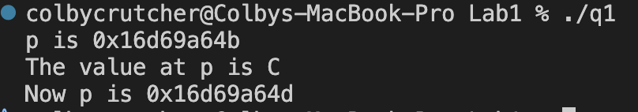
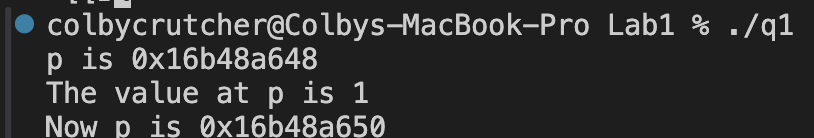
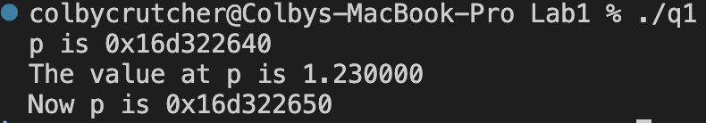
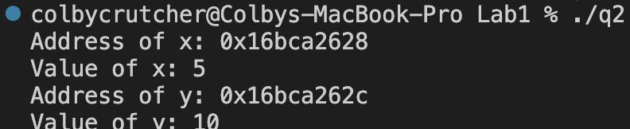
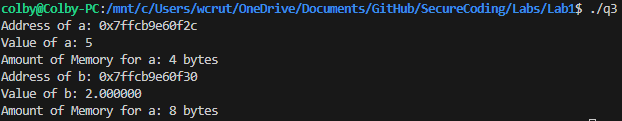
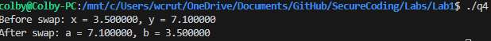

Colby Crutcher

Lab 1

Secure Coding


# Question 1
a. (3 points) Execute the program and explain the output.



- The first line points p to the address of c, and prints out that value. So it prints "p is 0x16da9664b" which is the memory location address.

- The second print value states "The value of p is C". This points *p to c, and returns the character 'C'.

- The third print says "Now p is 0x16da9664c". Prior to this print statement, p = p + 1 was executed, so the hex value of the location increased by one byte. 0x16da9664b ---> 0x16da9664c.

b. (3 points) Modify the code to perform the same pointer arithmetic on a pointer to an int. Execute the program and explain the output.



- The output is essentially the same. I had to change the char in the f-string to accept an integer, as well as making defined c and *p as ints. The first line is the address in memory for p, the second just shows the actual value, which is an integer, and the address changes when we change the pointer address to + 1 by 4 bytes, which is also confirmed because that is the size of an integer in C.

c. (3 points) Modify the code again to perform the same pointer arithmetic on a pointer to a
double. Execute the program and explain the output.



This modification changes the output to accept a double/floating point value (allow decimal values). The same output occurs, it prints the address, then the double, then adds 1 to the address's value, ultimately changing the address where p is stored. 

d. (6 points) What should happen if the line p = p + 1 is changed to p = p + 2 in parts
a-c above? Execute the program with this change (for all of parts a-c) to verify your answer.

- a. This changes the address value from 0x16d69a64b to 0x16d69a64d.The 'b' at the end of the address value changed to a 'd', which means it changed 2 bytes in size, so it doubled going from p + 1 to p + 2.



- b.  This changes the address from 0x16b48a648 to 0x16b48a650, a change of 8 bytes. 1 int was 4 bytes, so this makes sense that it doubles.



- c. This changes the address from  0x16d322640 to 0x16d322650, essentially just a change of 16 bytes, which doubles from the p + 1, which was 8. 



In conclusion, doing this doubled the bytes for the different types.

# Question 2

- (5 points) In the following program, add required lines of code to print the value and address 
of variable x in fun1, and variable y in fun2. Execute the program and precisely explain the 
output



- fun1 takes in an int of 5, stored at the address of 0x16bca2628. 
- fun2 doesn't take in any parameters, but declares the variable y as 10. I then print the address of y using %p, and feed it &y (which means address of y), which was 0x16bca262c. After that I just print the int value of y, being 10.

In conclusion because the size of an integer is 4, it increased by 4 more by bytes, due to fun2 having a two digit int. fun1 only had 1 int.


# Question 3
 
- (5 points) Write a program that declares and initializes (to any value) a double and an int. Your program should then print the address and the value stored in each of the variables, along with the amount of memory each variable occupies. 

```c
#include <stdio.h>


int main(){
    int a = 5;
    double b = 2.0;

    printf("Address of a: %p\n", &a);
    printf("Value of a: %d\n", a);
    printf("Amount of Memory for a: %ld bytes\n", sizeof(a));


    printf("Address of b: %p\n", &b);
    printf("Value of b: %f\n", b);
    printf("Amount of Memory for a: %ld bytes\n", sizeof(b));


    return 0;
}


```




# Question 4

- (5  points) Write  a  function  that  accepts  two  double  variables  as  parameters  (by  value)  and swaps  their values. Then  call the function in  the  main  function to  verify  that your function works correctly. 

```c
#include <stdio.h>

void swap(double a, double b){
    double temp;
    temp = a;
    a = b;
    b = temp;
    printf("After swap: a = %f, b = %f\n", a, b);
}


int main(){
    
    double x = 3.5;
    double y = 7.1;

    printf("Before swap: x = %f, y = %f\n", x, y);

    swap(x, y);

    return 0;
}
```

