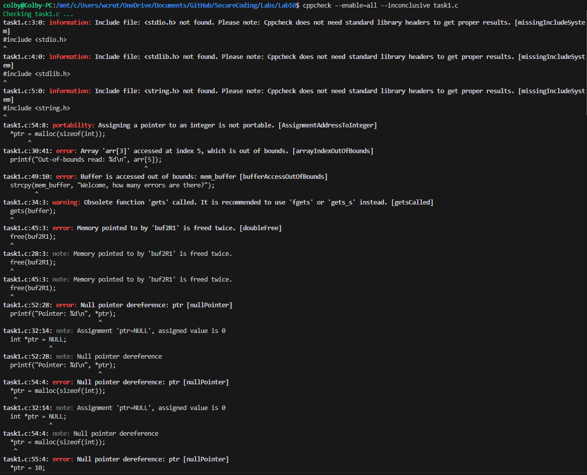
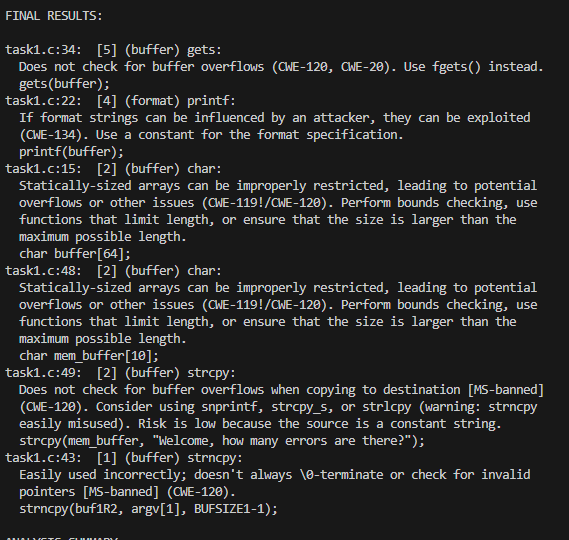
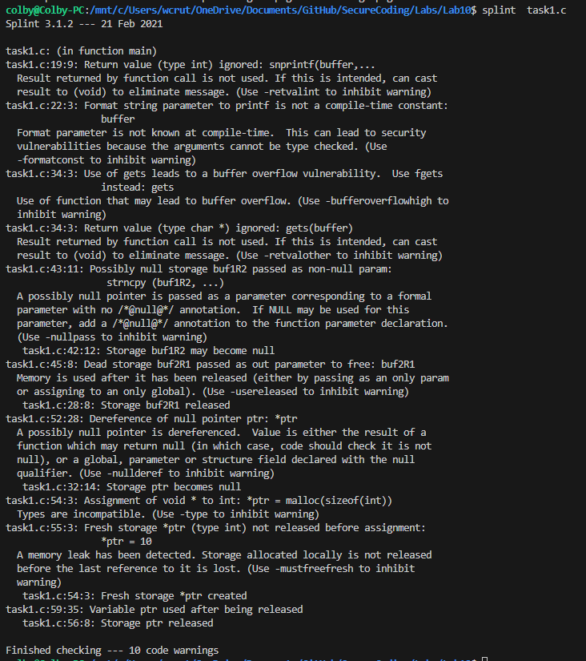
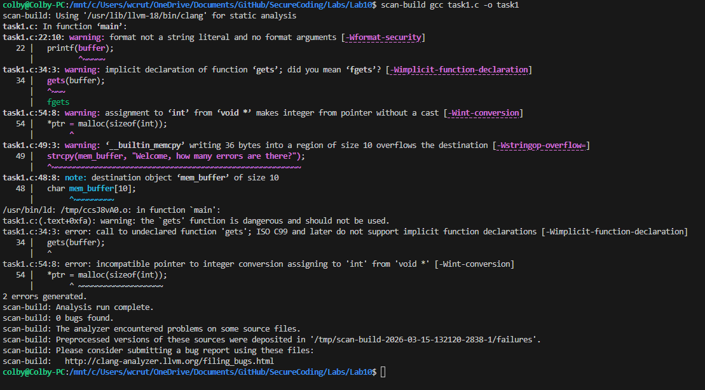
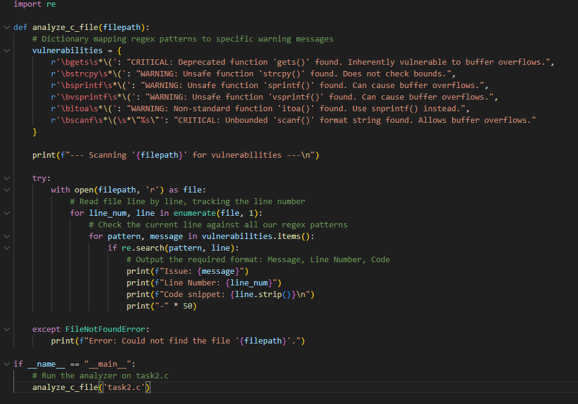

Colby Crutcher

Lab 10

Secure Coding


# Task 1


## 1. cppcheck



- Line 30 - arr[5] is accessed, and since arr was declared as int arr[3] (which only has  indices of 0, 1, and 2), accessing index 5 points to memory outside the array's allocated boundaries.

- Line 49 - The 36-byte string (including the null terminator) exceeds the 10-byte allocation of mem_buffer,

- Line 45 - Frees the memory buf2R1 twice, which was already freed on line 28, which can cause corrupt memory, and can crash the program, or be exploited by an attacker to execute arbitrary code. 

- Line 52 - Null pointer reference, which can cause the program to crash with a segmentation fault. 

- Line 54 -  code attempts to write to the ptr, but this is an invalid operation and will cause a crash. 

- Line 55 - same as 54, attempts to write int 10 to the null memory address.


## 2. Flaw Finder
 
 
 
 -  On line 34, it uses gets, which is a depricated C function, so it can be exploited using a  buffer overflow. FlawFinder tells us to use fgets() instead, so we can do a bounds check, preventing a potential overflow.

- On line 22, we have a format string vulnerability because the buffer variable is populated by user input (argv[1]), passing it directly to printf without a format specifier, and this allows an attacker to input format tokens like %x or %n to read from or write to the program's memory.

 - On line 15, and 48, we have a similar issue between the two, a statically-sized array. This is due to the char buffer[64] and char mem_buffer[10]. They arent vulnerabilites, but since they aren't managed later in the code, they can fall victim of overflow attacks if the bounds aren't managed.
 
 - On line 49, there is a strcpy vuln, which copies characters until it encounters a null terminator, not verifying size, which can easily lead to a buffer overflow

 - Line 43 uses strncpy which is safer than strcpy, but can be misused. If the string is greater or equal to the buffer size, it can lead to an out-of-bound read.

## 3. Splint



-  Line 19 & 34 - Return value of snprintf() and gets() are ignored. Tells us to use fgets() as well because it is safer due to bounds checking. 

- Line 43 - malloc is called to allocate memory for buf1R2 on line 42. If the system is out of memory, malloc returns NULL. Because we didn't check if buf1R2 == NULL before passing it to strncpy on line 43, splint warns that we might be passing a null pointer

- Line 45 - the memory was released on line 28, so freeing it again on line 45 is operating on "dead storage.", same thing as our ccpcheck and splint. 

- Line 55 - On line 54, memory is allocated. On line 55, *ptr = 10; attempts to overwrite that location. Splint sees this as a potential memory leak because the newly allocated "fresh storage" hasn't been properly managed or freed.

- Line 59 - memory pointed to by ptr is freed on line 56 using free(ptr). However, on line 59, the code tries to print the value at that address: 
```
           printf("Use after free: %d\n", *ptr);
```
- Accessing memory after it has been returned to the system can lead to crashes or allow attackers to execute arbitrary code if they reallocate and control that memory block.

### 4. Clang Static Analyzer




- Line 22: Format string vulnerability at printf(buffer);

- Line 34: Unsafe input function using gets(buffer); 

- Line 49: Stack buffer overflow from copying a long string into char mem_buffer[10]

- Line 54: Invalid pointer/integer assignment at *ptr = malloc(sizeof(int));


### Comparative Analysis

Overall, the four tools overlap on several major issues, but each emphasizes different classes of problems. cppcheck was effective at identifying memory safety errors such as out-of-bounds access, null-pointer dereference, and double free. Flawfinder focused more on dangerous library functions and insecure coding patterns such as gets, strcpy, and uncontrolled format strings. Splint provided more semantic and flow-based warnings, including ignored return values, potential null-pointer use, dead storage, and use-after-free behavior. Clang Static Analyzer additionally exposed compile-time and type-related errors, showing that some defects prevented deeper analysis from completing.


# Task 2

My code: 





For Task 2, I wrote a Python script that uses the re library to scan our C code for vulnerable or deprecated functions, basically acting like a custom, lightweight version of Flawfinder. Utilizing the re module, I use pythons' built in lib for regex. To do this, I set up a dictionary that maps specific regex patterns—like ```bgets\s*\(``` or unbounded scanfs—to custom warning messages. The script opens task2.c and reads it line by line using enumerate() so I can keep track of the exact line numbers. As it loops through the file, it checks each line against my dictionary of dangerous functions using re.search(), and whenever it gets a hit, it prints out the specific warning message, the line number, and the stripped line of code so the user knows exactly where the vulnerability is. To run my prog: python3 scan.py task2.c

My output:

```shell
colby@Colby-PC:Lab10$ python3 scan.py task2.c 
--- Scanning 'task2.c' for vulnerabilities ---

Issue: CRITICAL: Deprecated function 'gets()' found. Inherently vulnerable to 
buffer overflows.
Line Number: 85
Code snippet: gets(current->id);

--------------------------------------------------
Issue: WARNING: Unsafe function 'sprintf()' found. Can cause buffer overflows.
Line Number: 169
Code snippet: sprintf(index, "Insert: %s", "Index Out of Bounds");

--------------------------------------------------
Issue: WARNING: Non-standard function 'itoa()' found. Use snprintf() instead.
Line Number: 218
Code snippet: itoa(-123456789, current->id, 10);

--------------------------------------------------
Issue: WARNING: Unsafe function 'vsprintf()' found. Can cause buffer overflows.
Line Number: 234
Code snippet: vsprintf(msg_buf, fmt, args);

--------------------------------------------------
Line Number: 234
Code snippet: vsprintf(msg_buf, fmt, args);

Line Number: 234
Code snippet: vsprintf(msg_buf, fmt, args);
Line Number: 234
Line Number: 234
Code snippet: vsprintf(msg_buf, fmt, args);

--------------------------------------------------
Issue: CRITICAL: Unbounded 'scanf()' format string found. Allows buffer overflows.
Line Number: 269
Code snippet: scanf("%s", input);
Line Number: 234
Code snippet: vsprintf(msg_buf, fmt, args);

--------------------------------------------------
Issue: CRITICAL: Unbounded 'scanf()' format string found. Allows buffer overflows.
Line Number: 269
Line Number: 234
Code snippet: vsprintf(msg_buf, fmt, args);

--------------------------------------------------
Issue: CRITICAL: Unbounded 'scanf()' format string found. Allows buffer overflows.
Line Number: 234
Code snippet: vsprintf(msg_buf, fmt, args);

--------------------------------------------------
Line Number: 234
Code snippet: vsprintf(msg_buf, fmt, args);
Line Number: 234
Line Number: 234
Line Number: 234
Line Number: 234
Code snippet: vsprintf(msg_buf, fmt, args);

--------------------------------------------------
Issue: CRITICAL: Unbounded 'scanf()' format string found. Allows buffer overflows.
Line Number: 269
Code snippet: scanf("%s", input);
```