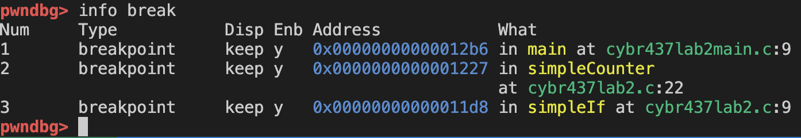

Colby Crutcher

Lab 3

Secure Coding

# Part 1
In this section, you’ll be using pwndgb to perform some static analysis of the included binary (the 
C source files are not included and so commands like list will not be usable). 
 
1. Disassemble main and state the contents of main. (print statements and function calls in 
proper order)  

- FILL THIS OUT!!!

2. Set a breakpoint at line 23 of main and on each of the two functions being called from main.

- I attempted to set a breakpoint at line 23 of main. Because the program was not compiled with full debugging symbols, GDB resolved the breakpoint to line 9, which is the closest valid instruction within main. The breakpoint was still successfully set at the beginning of main

3. Start running the program. What are the contents of the first string in main? 

4. Continue to the next breakpoint. What is the name and the value being passed into the 
function called? 

5. What function did you just come from and what function are you stopped in? 

6. Disassemble this function you are stopped at and capture the output 

7. How many print functions are in this current function you are stopped at?  
Hint: There is more than one type of print statement. 

8. Examining the disassembled code, grab the memory address of the constant from the 
function you’re stopped at and display its location in the process image. 

9. Continue running (enter 15). What function are you currently stopped at, what is the 
name and the value being passed into the function you are currently stopped at? 

10. What is the value of the first string in this function you are stopped at, and what is the name 
and the type of the global variable in the function where you are stopped in?  
Hint: notice the legend. 

11. What section (from the legend) is the global variable located in? 

12. Disassemble this function you are stopped at and capture the output 

13. Look for the cmp instruction in the assembly from the disassembled code. What value is 
the variable from question 14 being compared to? 

14. What area of the process image is the variable s located, what storage class is it? 
Hint: notice the value of s as it enters the function that is called twice. 

15. Display 64 addresses of the stack (NOTE: this is not backtrace).

# Part 2