Colby Crutcher

Lab 3

Secure Coding

# Part 1
In this section, you’ll be using pwndgb to perform some static analysis of the included binary (the 
C source files are not included and so commands like list will not be usable). 
 
1. Disassemble main and state the contents of main. (print statements and function calls in 
proper order)  

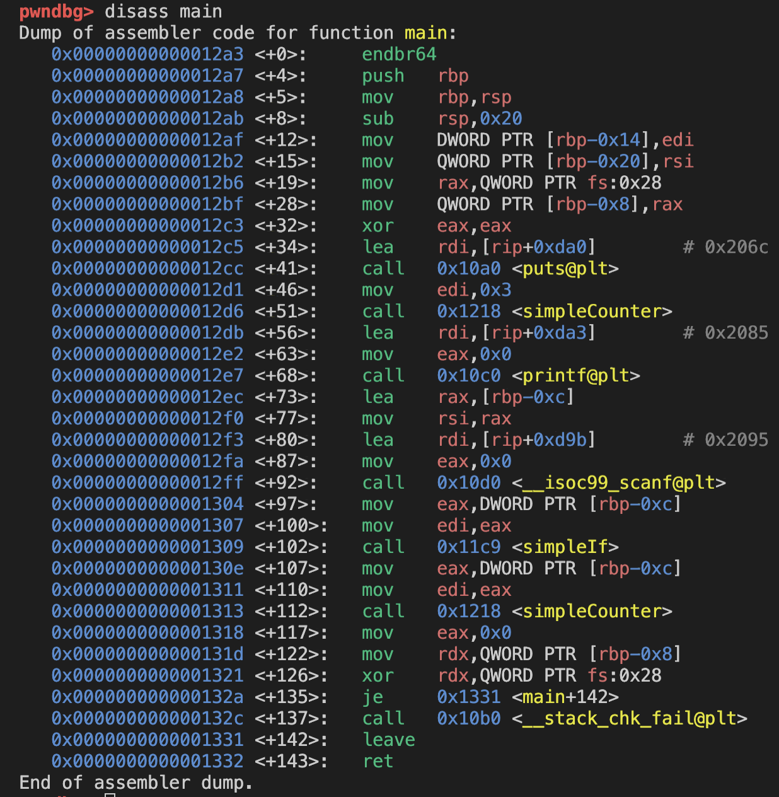

 4 → main at cybr437lab2main.c:9
 
 5 → main at cybr437lab2main.c:23

6 → simpleCounter at cybr437lab2.c:22

7 → simpleIf at cybr437lab2.c:9

2. Set a breakpoint at line 23 of main and on each of the two functions being called from main.

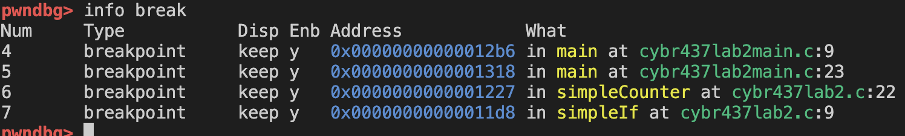

3. Start running the program. What are the contents of the first string in main? 

- The first string is "This is a pwndbg program"

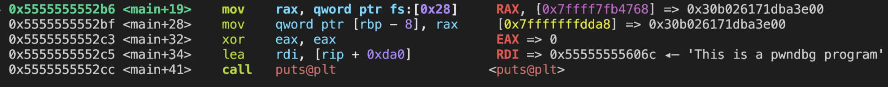c

4. Continue to the next breakpoint. What is the name and the value being passed into the 
function called? 

- This function is called simpleCounter. The value being passed into it is num = 3.

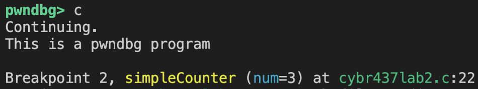

5. What function did you just come from and what function are you stopped in? 

- We are in simpleCounter, and we came from main. 

6. Disassemble this function you are stopped at and capture the output 

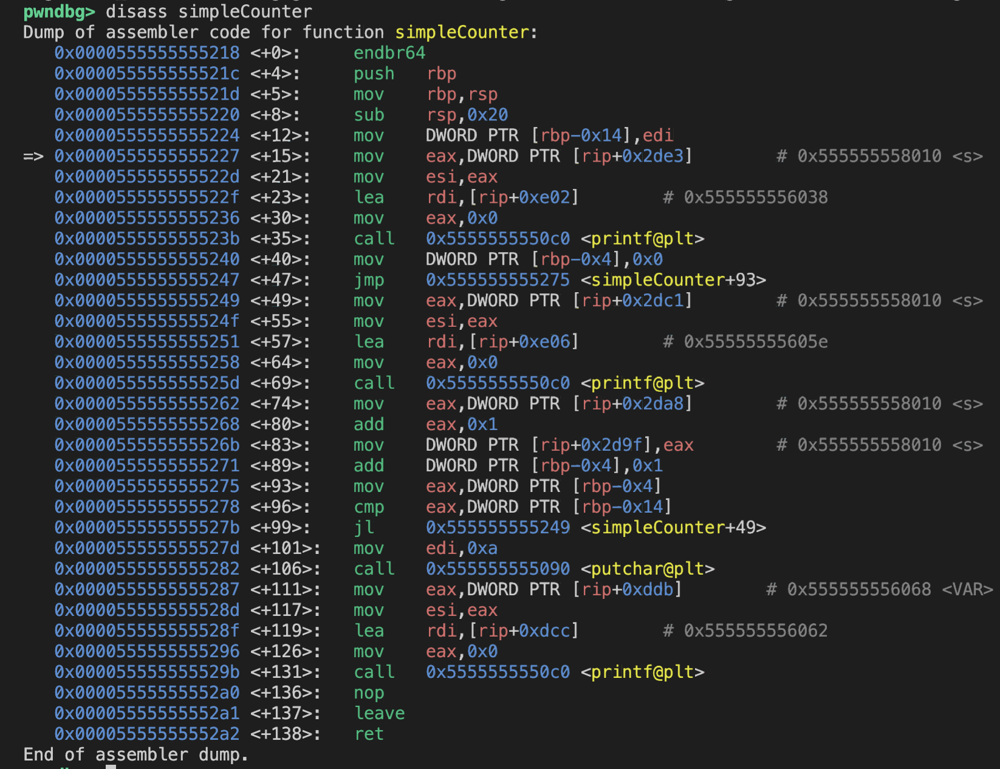

7. How many print functions are in this current function you are stopped at?  
Hint: There is more than one type of print statement. 

- There are 4 print functions. There are 3 printf, and one putchar function.

8. Examining the disassembled code, grab the memory address of the constant from the 
function you’re stopped at and display its location in the process image. 

- The location of the constant is 0x555555556038

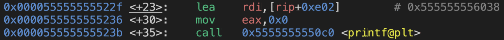

9. Continue running (enter 15). What function are you currently stopped at, what is the 
name and the value being passed into the function you are currently stopped at? 

- The function that we stopped in is simpleIf, and the value being passed in is num=15, which is what we entered in the terminal.

10. What is the value of the first string in this function you are stopped at, and what is the name 
and the type of the global variable in the function where you are stopped in?  
Hint: notice the legend. 

- The value is: "Sorry you didn't win", which is at 0x555555556019.  

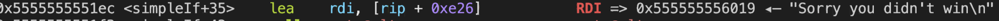

- The type of global variable in the function is a double named 'MAX'.

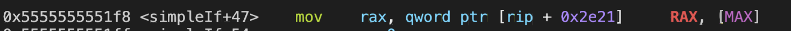

11. What section (from the legend) is the global variable located in? 

- It is located in the DATA section:

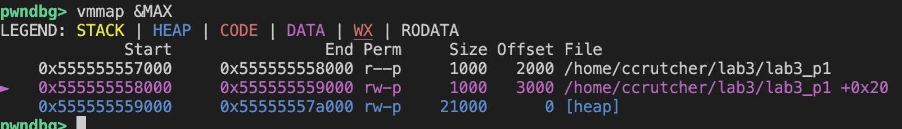

12. Disassemble this function you are stopped at and capture the output 

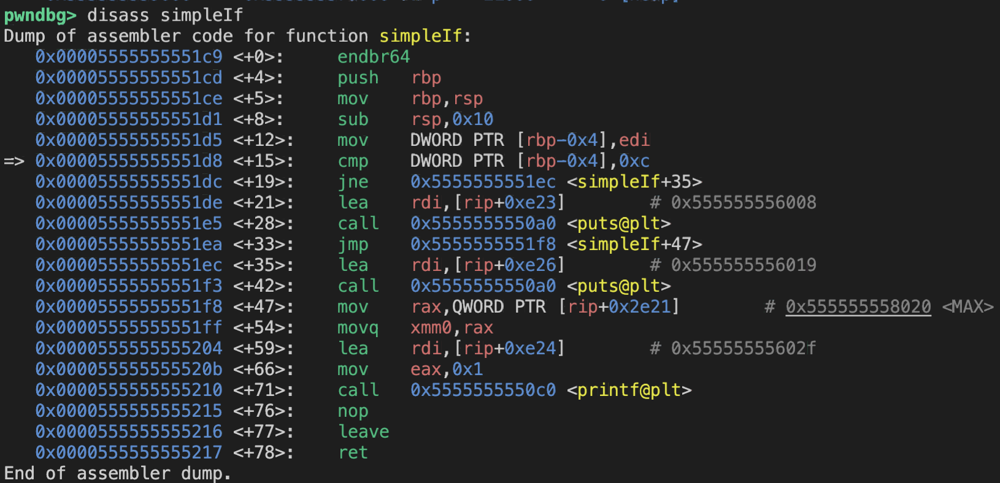

13. Look for the cmp instruction in the assembly from the disassembled code. What value is the variable from question 14 being compared to? 

- It is being compared to 0xc, which is 12 in decimal.

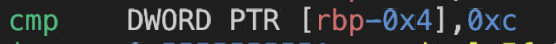

14. What area of the process image is the variable s located, what storage class is it? 
Hint: notice the value of s as it enters the function that is called twice. 

<!-- - The variable s is located at 0x555555558010 in the DATA area of the process image (writable global memory). Its storage class is global / static storage duration. -->

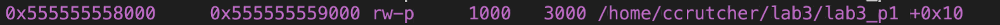

- The variable s is located on the stack and has automatic storage duration.

15. Display 64 addresses of the stack (NOTE: this is not backtrace).

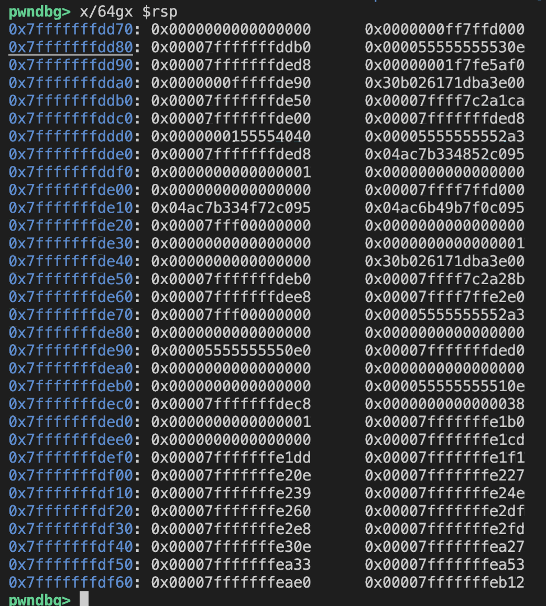

# Part 2

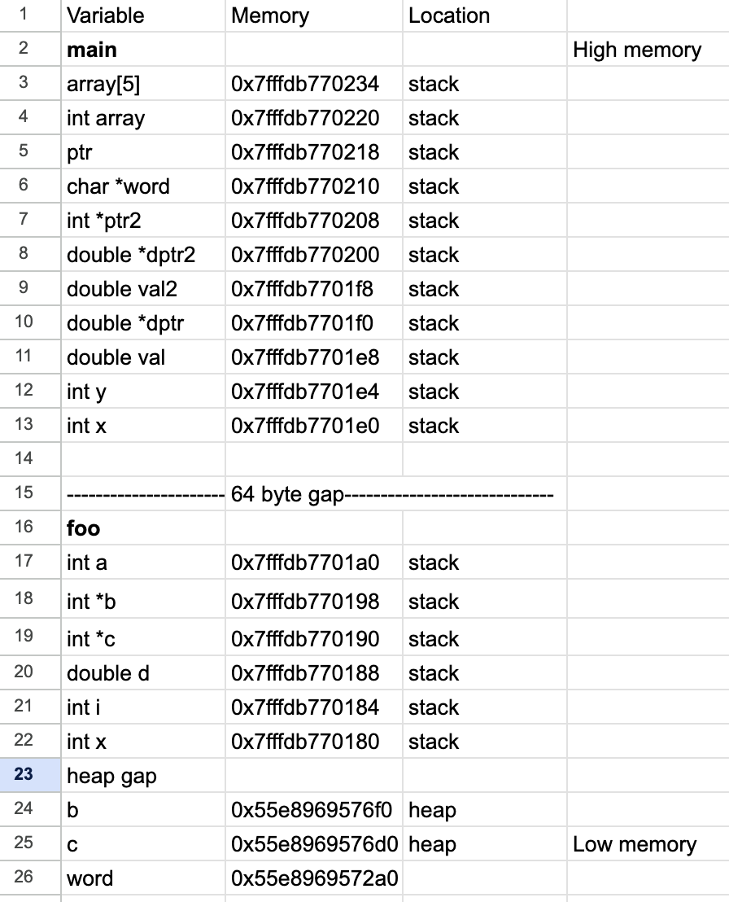