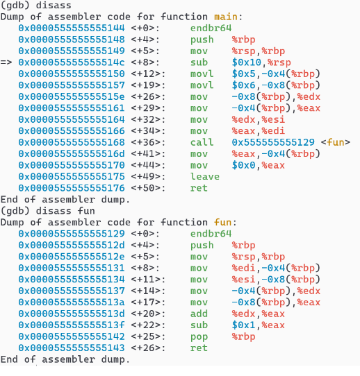
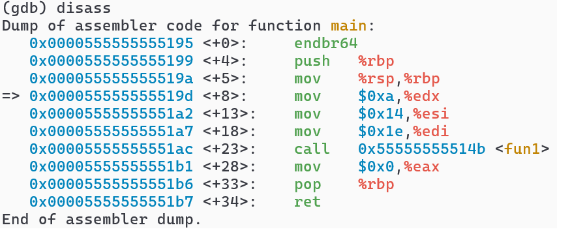
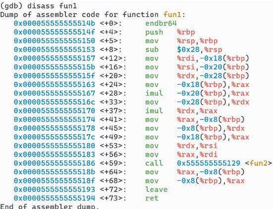
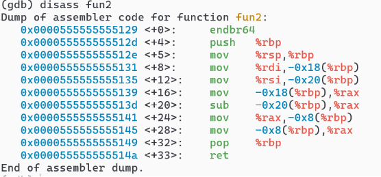

Colby Crutcher

Lab 4

Secure Coding


# Part 1

1. 


- movl $0x19,-0x4(%rbp)
Store 32-bit value 0x19 = 25 → local int a.

- movl $0x1e,-0x8(%rbp)
Store 32-bit value 0x1e = 30 → local int b.

- movq $0x2d,-0x10(%rbp)
Store 64-bit value 0x2d = 45 → local 64-bit variable (long/long long) at -0x10.

- mov -0x4(%rbp),%eax/%edx = copies the values of aoffsets -4, and -8 into registers

- add %edx, %eax = a + b because it adds the values in %edx which is a, to the b value, which is %eax. It stores the result in %eax as well.

- sub -0x10(%rbp),%rax = the subtraction of the value c. it subtracts the value c located at offset memory -0x10, from the sum currently in the register.

- mov %rax, -0x10(%rbp) = This converts to c = (a + b) - c. It moves the final result from the register back into the memory location for variable `c`, updating its value.

### Code in C:


```c
int main(){
    int a = 25;      // 0x19
    int b = 30;      // 0x1e
    long c = 45;     // 0x2d  (stored as 8 bytes)

    c = (long)(a + b) - c;   // = 55 - 45 = 10

    return 0;
}

```


2. 


- movl 0x4(%rbp) → int x, stores a 32-bit value 0x19 = 25 into local stack slot -0x4 → local int x = 25;

- movl 0x8(%rbp) → int y, stores 32-bit value 0x1e = 30 into local stack slot -0x8 → local int y = 30;

- mov -0x4(%rbp),%eax → loads the 32-bit value at -0x4(%rbp) (x) into %eax → %eax = x; (Now the compare will use %eax vs y.)

- cmp -0x8(%rbp),%eax → Compares %eax (x) with the value at -0x8(%rbp) (y).
Internally it does %eax - y to set CPU flags (ZF/SF/OF), without storing the subtraction result. This is a conditional statement

- jle 0x555555555150 <main+39> → Jump if Less-or-Equal (signed) based on the flags from cmp. If x <= y, jump to <main+39> (the “if” branch).

- movl $0x1,-0xc(%rbp) → runs only if the jump was not taken (meaning x > y).
Store 1 into local stack slot -0xc → flag/result = 1; (the “else” case)

- jmp 0x555555555157 <main+46> → Unconditional jump to skip over the “if” assignment, so the result is not overwritten.

- movl $0x0,-0xc(%rbp) → This runs only if jle was taken (meaning x <= y).
Store 0 into local stack slot -0xc → z = 0; (the “if” case)

- 0xc(%rbp) → int z

- mov $0x0,%eax → sets return value register to 0 → return 0;


### Code in C:

```c
int main(void) {
    int x = 25;   // Corresponds to: movl $0x19, -0x4(%rbp)
    int y = 30;  // Corresponds to: movl $0x1e, -0x8(%rbp)
    int z; // Corresponds to storage at -0xc(%rbp)

    if (x <= y) {     // movl $0x0, -0xc(%rbp)
        z = 0;
    } else { //movl $0x1, -0xc(%rbp)
        z = 1;
    }

    return 0; //mov $0x0, %eax
}
```


3. 


- movq $0xa,-0x40(%rbp) → Stores 64-bit value 0x0a = 10 into stack slot -0x40.
This corresponds to the first element of a local long array → arr[0] = 10;

- movq $0x14,-0x38(%rbp) → Stores 64-bit value 0x14 = 20 into stack slot -0x38.
This corresponds to → arr[1] = 20;

- movq $0x1e,-0x30(%rbp) → Stores 64-bit value 0x1e = 30 into stack slot -0x30.
This corresponds to → arr[2] = 30;

- movq $0x28,-0x28(%rbp) → Stores 64-bit value 0x28 = 40 into stack slot -0x28.
This corresponds to → arr[3] = 40;

- movq $0x32,-0x20(%rbp) → Stores 64-bit value 0x32 = 50 into stack slot -0x20.
This corresponds to → arr[4] = 50;

- movq $0x0,-0x10(%rbp) → Stores 64-bit value 0 into stack slot -0x10.
This initializes the loop counter → long i = 0;

- jmp 0x555555555175 <main+76> → Unconditional jump to the loop condition check before executing the loop body. This is how a while or for loop is implemented in assembly.

- mov -0x10(%rbp),%rax → Loads the current value of i into %rax → %rax = i;

- mov -0x40(%rbp,%rax,8),%rax → Loads the value of arr[i] into %rax.
Explanation: -0x40(%rbp) is the base address of the array, %rax is the index, and *8 accounts for 8-byte (long) elements.

- add %rax,-0x8(%rbp) → Adds the value of arr[i] to the variable stored at -0x8(%rbp). This corresponds to → sum += arr[i];

- addq $0x1,-0x10(%rbp) → Increments the loop counter stored at -0x10(%rbp) → i++;

- cmpq $0x4,-0x10(%rbp) → compares the loop counter i to 4 by computing i - 4 and setting CPU flags. This prepares for a conditional loop check.

- jle 0x555555555163 <main+58> → Jump if Less-or-Equal (signed). If i <= 4, control jumps back to the loop body, continuing the loop.

- mov $0x0,%eax → Sets the return value register to 0 → return 0;

### Code in C:


```c
int main(void) {
    long arr[5] = {10, 20, 30, 40, 50};
    long i = 0;
    long sum = 0;          // this corresponds to -0x8(%rbp)

    while (i <= 4) {
        sum += arr[i];
        i++;
    }
    return 0;
}


```

4. 




##### main:

- movl $0x5,-0x4(%rbp) → stores 32-bit value 0x5 = 5 into local int → int a = 5;

- movl $0x6,-0x8(%rbp) → stores 32-bit value 0x6 = 6 into local int → int b = 6;

- mov -0x8(%rbp),%edx → loads b into %edx → %edx = b;

- mov -0x4(%rbp),%eax → loads a into %eax → %eax = a;

- mov %edx,%esi → copies %edx (b) into %esi (2nd integer argument register) → sets up arg2 → 2nd arg = b;

- mov %eax,%edi → copies %eax (a) into %edi (1st integer argument register) → sets up arg1 → 1st arg = a;

- call 0x555555555129 <fun> → calls fun(a, b) and gets the return value in %eax.

- mov %eax,-0x4(%rbp) → stores return value back into local a → a = fun(a, b);

- mov $0x0,%eax → sets return value to 0 → return 0;


##### fun:

- mov %edi,-0x4(%rbp) → stores the 1st argument into local int → x = arg1;

- mov %esi,-0x8(%rbp) → stores the 2nd argument into local int → y = arg2;

- mov -0x4(%rbp),%edx → loads x into %edx → %edx = x;

- mov -0x8(%rbp),%eax → loads y into %eax → %eax = y;

- add %edx,%eax → adds x into %eax → %eax = y + x; (so now %eax = x + y)

- sub $0x1,%eax → subtracts 1 from %eax → %eax = (x + y) - 1;

- ret (implied end) → returns with %eax holding the result → return (x + y) - 1;


### Code in C:

```c
int fun(int x, int y) {
    // fun returns the sum of the two args minus 1
    return (x + y) - 1;
}

int main(void) {
    int a = 5;
    int b = 6;

    // call fun(a, b) and store result back into a
    a = fun(a, b);

    return 0;
}

```


5. 








##### main:
- mov $0xa,%edx → loads the constant 0x0a (= 10) into %edx, which is used as the 3rd integer argument register → sets up arg3 = 10.

- mov $0x14,%esi → loads the constant 0x14 (= 20) into %esi, which is the 2nd integer argument register → sets up arg2 = 20.

- mov $0x1e,%edi → loads the constant 0x1e (= 30) into %edi, which is the 1st integer argument register → sets up arg1 = 30.

- call 0x55555555514b <fun1> → calls the function fun1(arg1, arg2, arg3) using the calling convention registers → this corresponds to fun1(30, 20, 10);

- mov $0x0,%eax → sets the return value register to 0 → return 0;


```c
int main(void) {
    fun1(30, 20, 10);
    return 0;
}
```


##### fun1:

- mov %rdi,-0x18(%rbp) → saves 1st argument → x = arg1;

- mov %rsi,-0x20(%rbp) → saves 2nd argument → y = arg2;

- mov %rdx,-0x28(%rbp) → saves 3rd argument → z = arg3;

- mov -0x18(%rbp),%rax → loads x into %rax → %rax = x;

- imul -0x20(%rbp),%rax → multiplies %rax by y → %rax = x * y;

- mov -0x28(%rbp),%rdx → loads z into %rdx → %rdx = z;

- imul %rdx,%rax → multiplies %rax by %rdx → %rax = (x * y) * z; (so %rax = x*y*z)

- mov %rax,-0x8(%rbp) → stores the product into a local variable → prod = x*y*z;

- Call fun2(x, prod)

- mov -0x8(%rbp),%rdx → loads prod into %rdx → %rdx = prod;

- mov -0x18(%rbp),%rax → loads x into %rax → %rax = x;

- mov %rdx,%rsi → sets up 2nd argument register for the call → %rsi = prod;

- mov %rax,%rdi → sets up 1st argument register for the call → %rdi = x;

- call 0x555555555129 <fun2> → calls fun2(x, prod) which returns x - prod in %rax.

- mov %rax,-0x8(%rbp) → stores return value from fun2 → result = fun2(x, prod);

- mov -0x8(%rbp),%rax → loads result into %rax for return → return result;


```c
int fun1(int x, int y, int z) {
    // Multiply all three arguments
    int prod = x * y * z;

    // Call fun2 with x and the product
    // Returns x - (x * y * z)
    return fun2(x, prod);
}
```


##### fun2:

- mov %rdi,-0x18(%rbp) → saves 1st argument (in %rdi) into a local variable → a = arg1;

- mov %rsi,-0x20(%rbp) → saves 2nd argument (in %rsi) into a local variable → b = arg2;

- mov -0x18(%rbp),%rax → loads a into %rax → %rax = a;

- sub -0x20(%rbp),%rax → subtracts b from %rax → %rax = a - b; (this is the actual math)

- mov %rax,-0x8(%rbp) → stores the result (a - b) into a local variable → result = a - b;

- mov -0x8(%rbp),%rax → loads result back into %rax so it can be returned → return result;

```c
int fun2(int a, int b) {
    // fun2 subtracts the second argument from the first
    return a - b;
}

```


# Part 2

6. 

```c
#include <stdio.h> 
int main() { 
char city[10]; 
printf("Enter city: "); 
scanf("%s", city); 
printf("City: %s\n", city); 
return 0; 
}
```

- scanf("%s", city); has no length limit, so any input longer than 9 characters (+ null terminator) will overflow char city[10] and can corrupt stack data (stack canary will likely detect this).
