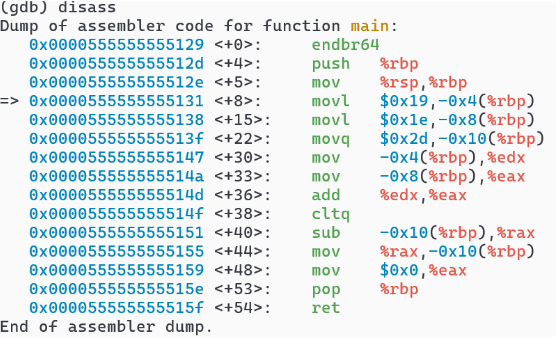
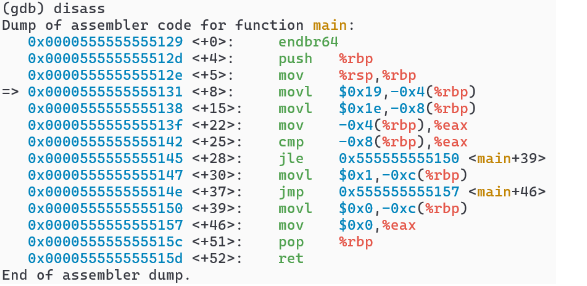
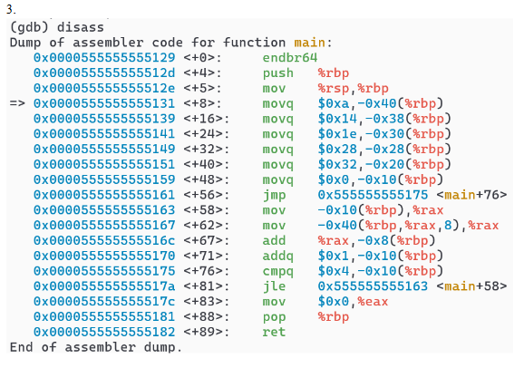

Colby Crutcher

Lab 4

Secure Coding

1. 



- movl $0x19,-0x4(%rbp)
Store 32-bit value 0x19 = 25 → local int a.

- movl $0x1e,-0x8(%rbp)
Store 32-bit value 0x1e = 30 → local int b.

- movq $0x2d,-0x10(%rbp)
Store 64-bit value 0x2d = 45 → local 64-bit variable (long/long long) at -0x10.

- mov -0x4(%rbp),%eax/%edx = copies the values of aoffsets -4, and -8 into registers

- add %edx, %eax = a + b because it adds the values in %edx which is a, to the b value, which is %eax. It stores the result in %eax as well.

- sub -0x10(%rbp),%rax = the subtraction of the value c. it subtracts the value c located at offset memory -0x10, from the sum currently in the register.

- mov %rax, -0x10(%rbp) = This converts to c = (a + b) - c. It moves the final result from the register back into the memory location for variable `c`, updating its value.

```c
int main(){
    int a = 25;      // 0x19
    int b = 30;      // 0x1e
    long c = 45;     // 0x2d  (stored as 8 bytes)

    c = (long)(a + b) - c;   // = 55 - 45 = 10

    return 0;
}

```


2. 



- movl 0x4(%rbp) → int x, stores a 32-bit value 0x19 = 25 into local stack slot -0x4 → local int x = 25;

- movl 0x8(%rbp) → int y, stores 32-bit value 0x1e = 30 into local stack slot -0x8 → local int y = 30;

- mov -0x4(%rbp),%eax → loads the 32-bit value at -0x4(%rbp) (x) into %eax → %eax = x; (Now the compare will use %eax vs y.)

- cmp -0x8(%rbp),%eax → Compares %eax (x) with the value at -0x8(%rbp) (y).
Internally it does %eax - y to set CPU flags (ZF/SF/OF), without storing the subtraction result. This is a conditional statement

- jle 0x555555555150 <main+39> → Jump if Less-or-Equal (signed) based on the flags from cmp. If x <= y, jump to <main+39> (the “if” branch).

- movl $0x1,-0xc(%rbp) → runs only if the jump was not taken (meaning x > y).
Store 1 into local stack slot -0xc → flag/result = 1; (the “else” case)

- jmp 0x555555555157 <main+46> → Unconditional jump to skip over the “if” assignment, so the result is not overwritten.

- movl $0x0,-0xc(%rbp) → This runs only if jle was taken (meaning x <= y).
Store 0 into local stack slot -0xc → z = 0; (the “if” case)

- 0xc(%rbp) → int z

- mov $0x0,%eax → sets return value register to 0 → return 0;

- 


```c
int main(void) {
    int x = 25;   // Corresponds to: movl $0x19, -0x4(%rbp)
    int y = 30;  // Corresponds to: movl $0x1e, -0x8(%rbp)
    int z; // Corresponds to storage at -0xc(%rbp)

    if (x <= y) {     // movl $0x0, -0xc(%rbp)
        z = 0;
    } else { //movl $0x1, -0xc(%rbp)
        z = 1;
    }

    return 0; //mov $0x0, %eax
}
```


3. 