Colby Crutcher

Secure Coding

Lab 5

### Task 1

- Endianness: 

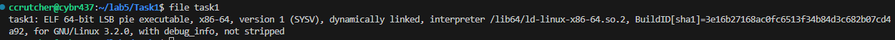


- Checksec:

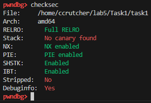

Code to overflow:

```c
from pwn import *

# Start program

io.sendlineafter(b':', b'AAAAAAAAAAAA\0')


```

- How I got here: I disassembled main, and found  that bytes A 1-10 fill the 10 byte gap, and 11 and 12 overflow, with \0 overwriting the third bye of the integer.

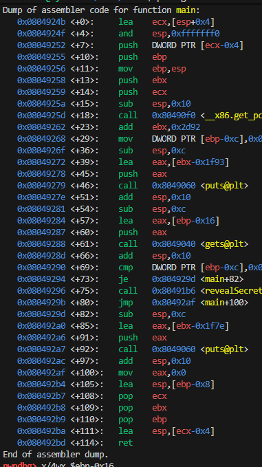

- Buffer starts at: ebp -22
Variable is at: ebp - 12
Distance: $22 - 12 = \mathbf{10}$ bytes.

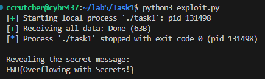

- We skipped the jne, so it flowed to the next line which was reveal secret: 

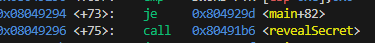

### Task 2

- Endianness

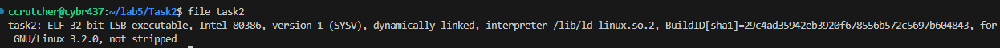


- checksec

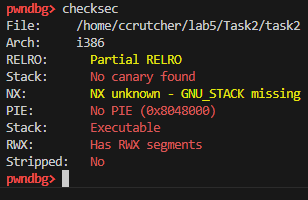

```c
io.sendlineafter(b':', b'A' * 25 + b'\x11\xfa\xad\xde')
```

- How I arrived at the vale or eip: I used pwndbg to dissasemble the binary, and found cmp with the pointer at '0xdeadfa11'. This told us that launch code was 12 bytes from the base pointer

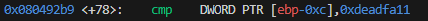

- I disassembled after this and got that at line <+18>: mov DWORD PTR [ebp-0xc],0x12345678. This puts the variable at ebp - 12

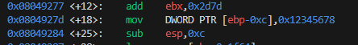

- There is 0x25 at the start of the buffer, which is 37 in decimal


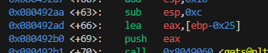

- 37-12 = 25, which is where I used to fill the gap, and the flag appears. 


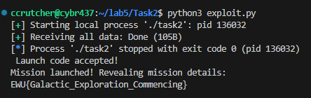


### Task 3

- Endianness

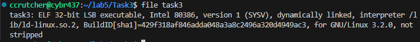

- Checksec

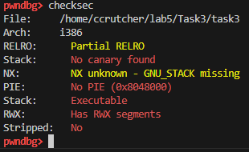

```c
io.sendlineafter(b':', b'A' * 32 + b'\xc6\x91\x04\x08')
```


- How I arrived at the value: First, I used 'info address revealArtifact', and this revealed the address. 

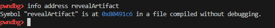


- From here we needed to figure out how many A's to send, so we can use cyclic comand to find a pattern. I did cyclic 50. 


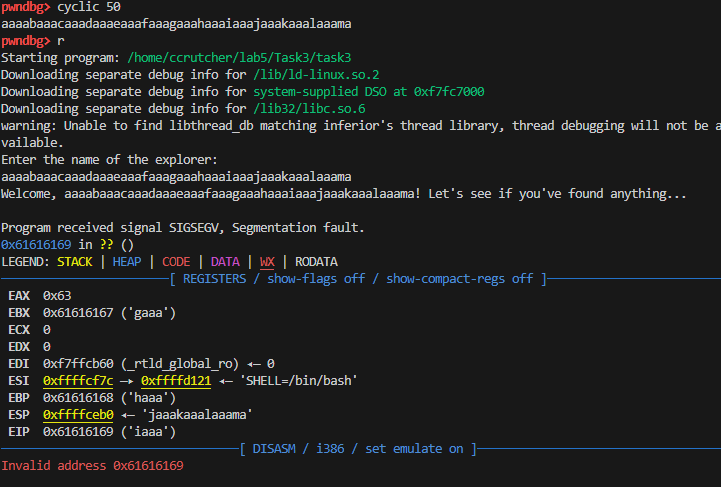

- Using the EIP value, I pasted it into another run using the -l flag. This gave us an offeset of 32 because in 32-bit systems, a 20-byte buffer is often padded to 28 bytes, plus 4 bytes for the Saved Base Pointer (EBP). $28 + 4 = 32$.


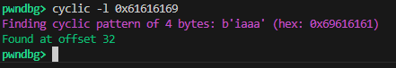


- That is how I came to the resoultion of 32 bytes for my padding., and used the address 0x080491c6 to little endian.

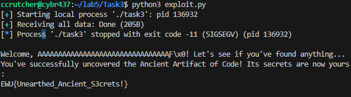


### Task 4

- Endianness

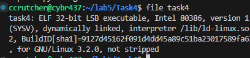

- checksec

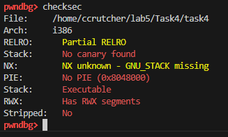

```c
io.sendlineafter(b':', b'A' * 44 + b'\xc6\x91\x04\x08' + b'DUMY' + b'\xce\xf1\x0f\x00' + b'\xff\x10\x00\xc0')


```

- I got tho this solution by first running p accessVault to get the addresss 0x80491c6.

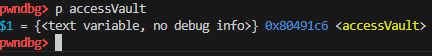

- After that we need to know how may A's to send to reach the EIP, so I generated the pattern using 'cyclic 100' then pasted that value into the hacker alias, to find the offset.

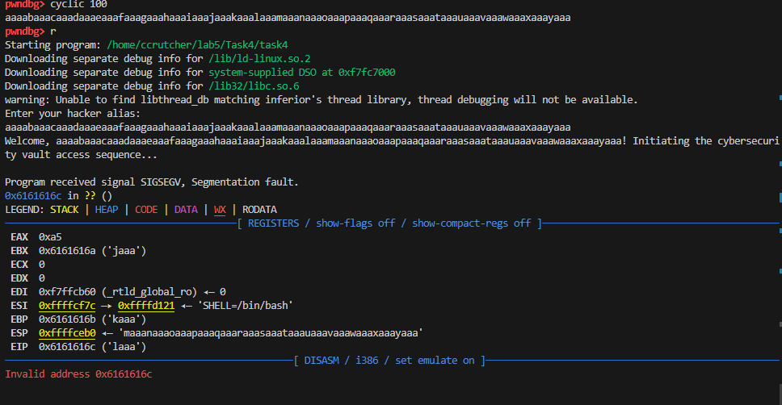

- From here we are grabbing the offset so doing cyclic -l 0x6161616c, which is the address in the EIP. This returned 44.

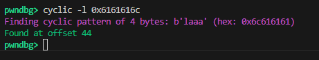


- When accessVault finishes running, it will try to "return" to whatever address is on the stack immediately after its own address. Since we don't care where it goes after printing the flag, we just put 4 bytes of junk, which is where the DUMY comes from.

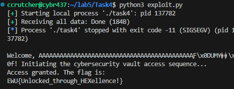