Colby Crutcher

Lab 6

Secure Coding

## Task 1

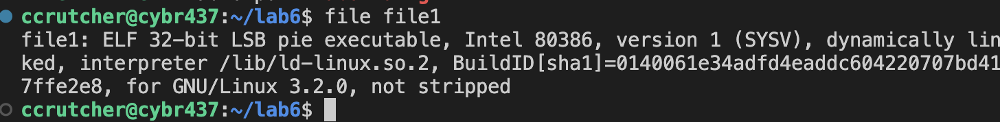

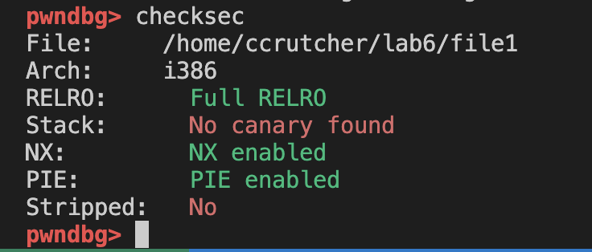

Disassembling main, we can see that the function 'welcome' is being called.

<!-- Make your own offset -->
<!-- Use the python from last lab -->

Disassembling welcome: 

We now need to find the offset. ($0x18$) below the Base Pointer We need 28 bytes of padding.

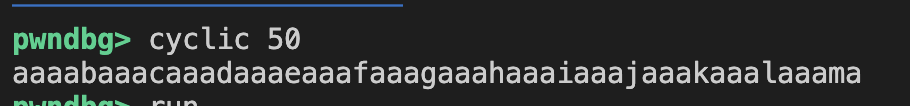

Running this into the program causes a seg fault, but doesn't break the code to print the function twice.

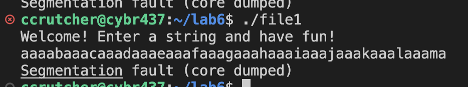

We now need to find the offset. ($0x18$) below the Base Pointer We need 28 bytes of padding.

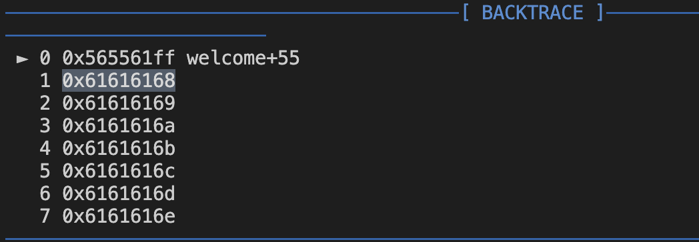

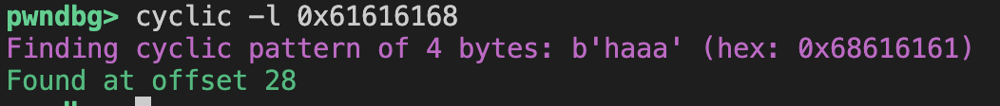

We need to calculate the vmmap.

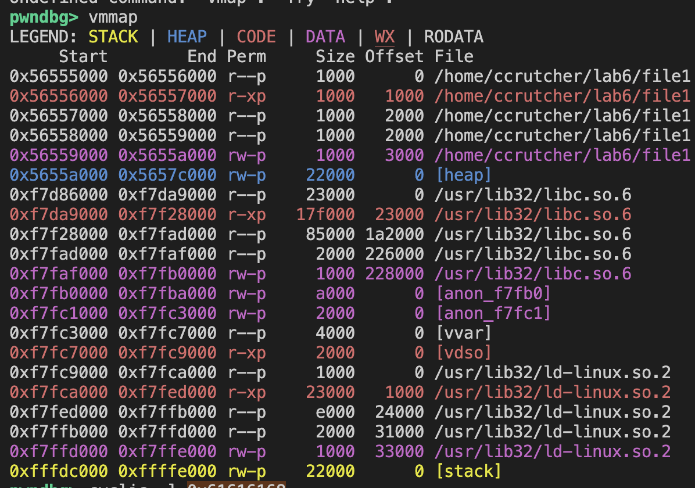{width=70%}

By overwriting the return address with the absolute address of secret, control flow is redirected after welcome returns

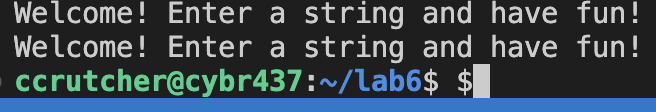

## Task 2

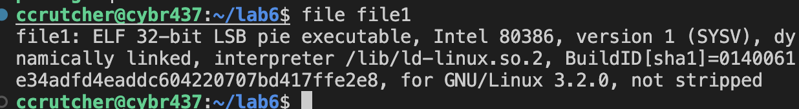

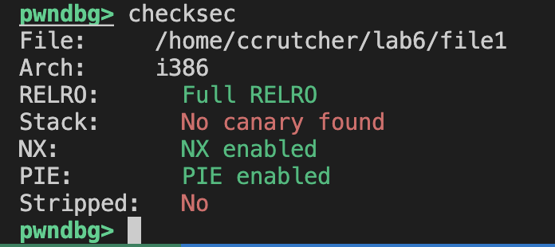

We need more info about the secret since it isn't called in main.

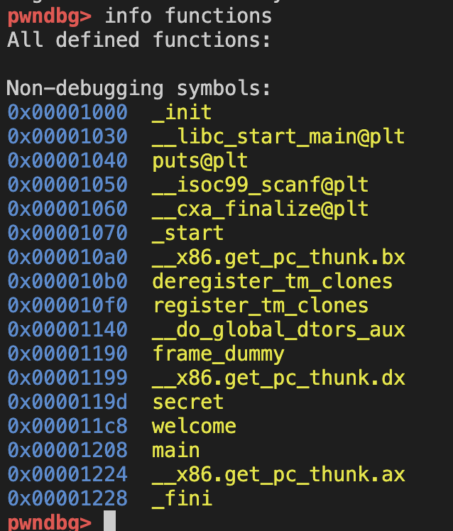

secret function is located at offset 0x0000119d

From task1, vmmap and disas main, our base is 0x56555000.

0x56555000 + 0x119d = 0x5655619d.

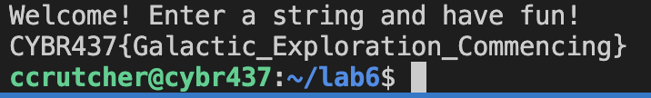