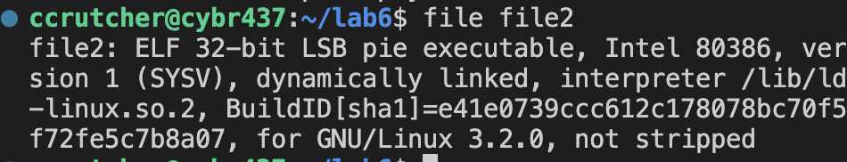
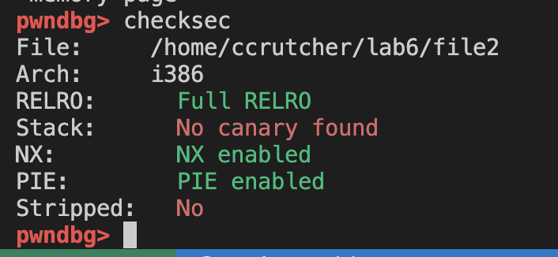
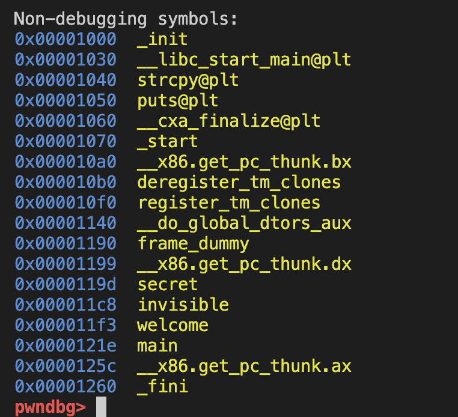
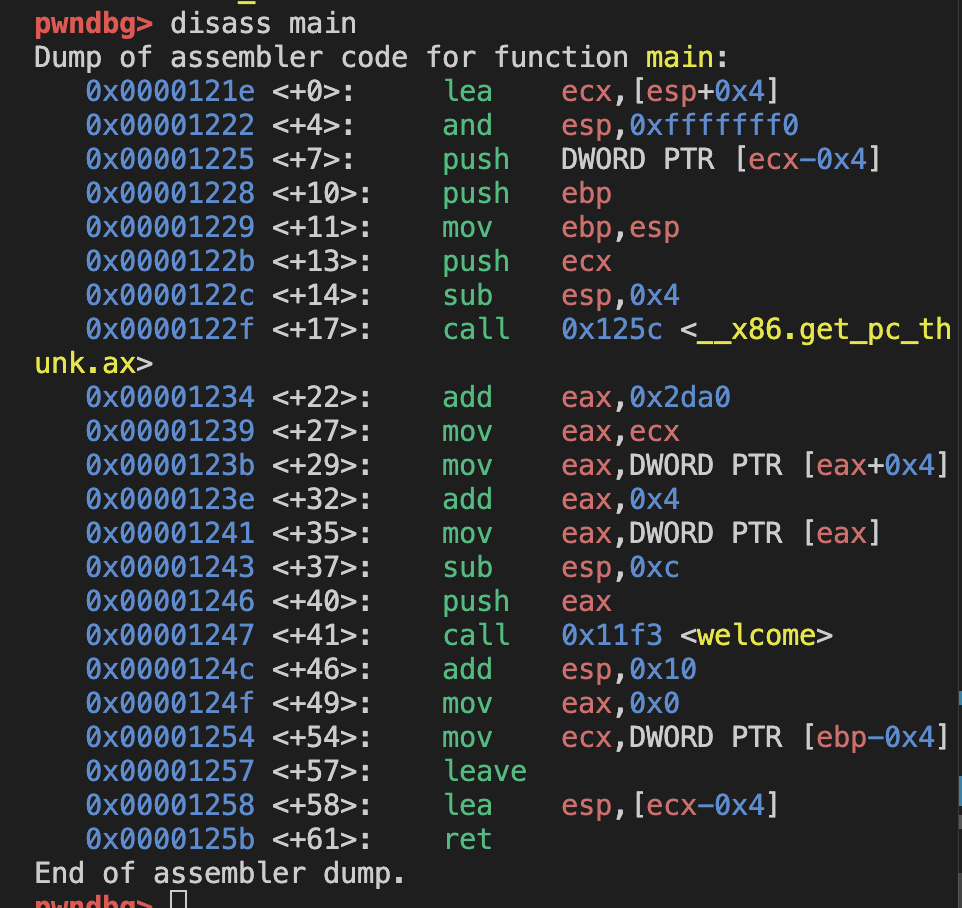
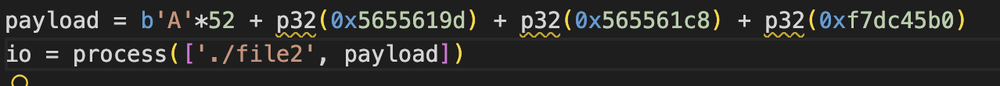
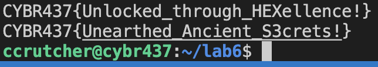

## Task 1

Disassembling main, we can see that the function 'welcome' is being called.

<!-- Make your own offset -->
<!-- Use the python from last lab -->

Disassembling welcome: 

We now need to find the offset. ($0x18$) below the Base Pointer We need 28 bytes of padding.

Running this into the program causes a seg fault, but doesn't break the code to print the function twice.

We now need to find the offset. ($0x18$) below the Base Pointer We need 28 bytes of padding.

We need to calculate the vmmap.

{width=70%}

Code I am sending: (b':', b'A'*28 + p32(0x565561c8) + p32(0xf7dc45b0))

\clearpage

## Task 2

We need more info about the secret since it isn't called in main.

\begin{figure}[H]
\centering
\includegraphics[width=0.7\textwidth]{image-11.png}
\caption{File1 endianness (Same as Task 1)}
\end{figure}

\begin{figure}[H]
\centering
\includegraphics[width=0.7\textwidth]{image-10.png}
\caption{File1 Checksec (same as Task 1)}
\end{figure}

\begin{figure}[H]
\centering
\includegraphics[width=0.8\textwidth]{image-13.png}
\caption{info functions}
\end{figure}

The secret function is located at offset `0x0000119d`.

From Task 1, vmmap and disassembly of main, our base is `0x56555000`.

added the offset 0x119d to the base address 0x56555000.

Code I am sending: (b':', b'A'*28 + p32(0x5655619d) + p32(0xf7dc45b0))

By overwriting the return address with the absolute address of secret, control flow is redirected after welcome returns

\clearpage

## Task 3

The only function being called in main is also the welcome function. When running the file as is, it instantly seg faults.

From the info functions command, we cna see two functions, secret, and invisible. We can investigate those more.

Using our current base address of 0x56555000
- Secret Address: 0x56555000 + 0x119d = 0x5655619d.
- Invisible Address: 0x56555000 + 0x11c8 = 0x565561c8.

Buffer Start: ebp - 0x30 (which is 48 bytes in decimal).

Saved EBP: Takes up 4 bytes immediately after the buffer.

Return Address: Located immediately after the Saved EBP.

Using the identified offsets and stack layout, I constructed an input that overwrites the return address twice, chaining execution from welcome → secret → invisible, allowing both flags to be printed before clean termination

 