Colby Crutcher

Secure Coding

Lab 7

# Challenge 1:

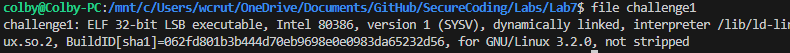

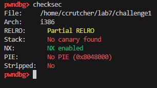

- Arriving at the EIP value:

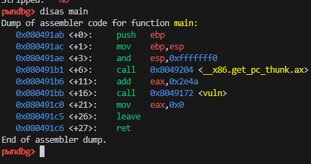

\clearpage

- Main calls a function called 'vuln'. 

- To start, I ran cyclic 100 to generate an input to crash the program. When I did I got the EIP register value:

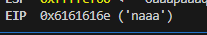

- I am going to throw this crash address back into cyclic to find the offset:

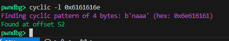

- We need to find the function we are trying to redirect the execution to, and info functions reveals flag, which we should investigate more:

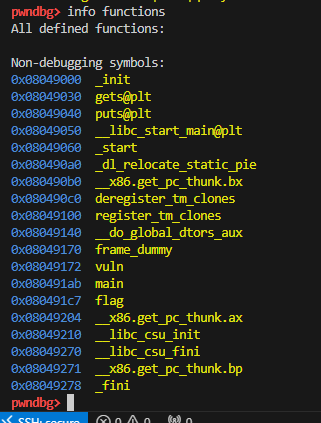

\clearpage

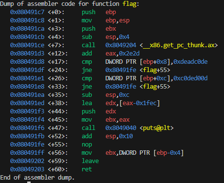

- In Figure 7, the assembly code shows two cmp (compare) instructions at <+17> and <+26>. These lines are checking the stack to make sure we passed in two specific arguments: 0xdeadc0de and 0xc0ded00d. To successfully run this function and get the flag, our exploit payload just needs to include those two exact hex values.

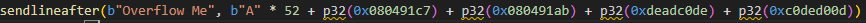

- First, we send 52 "A"s to overflow the program so we can hijack it and point it directly to the flag function. Then, we add the main function so the program doesn't crash, followed by the two exact numbers (0xdeadc0de and 0xc0ded00d)

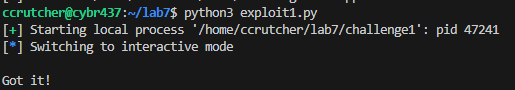

# Challenge 2

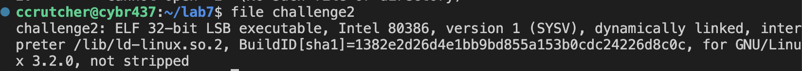

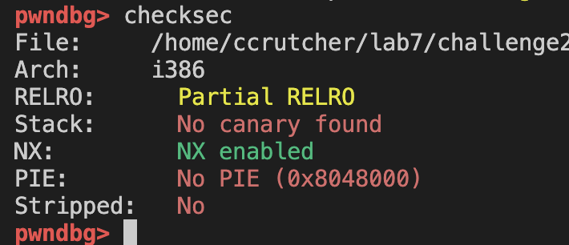