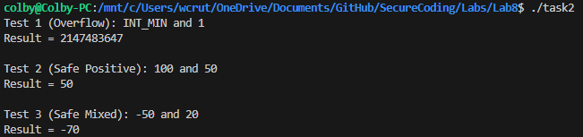
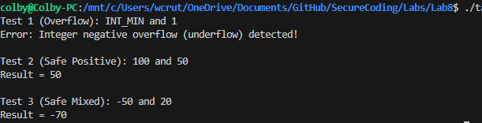

Colby Crutcher

Secure Coding

Lab 8


# Task 1

```c
void fun1 (int a, int b) { 
    int sum; 
    sum = a + b; 
    printf("Result = %d\n", sum); 
}

```

Vulnerability:

- The function adds two integers: sum = a + b. If the sum exceeds INT_MAX, it wraps around to a negative number.


Exploit:

- I chose INT_MAX because it is the largest permissible value, adding any positive integer to it guarantees the sum exceeds the storage capacity of a signed 32-bit integer, resulting in a wraparound to a negative value.

My main:

```c
int main() {
    // 1.values that cause an overflow
    printf("Test 1 (Overflow): INT_MAX and 1\n");
    fun1(INT_MAX, 1);

    // 2. Normal values that do not cause an overflow
    printf("\nTest 2 (Safe Positive): 100 and 200\n");
    fun1(100, 200);

    // 3. Normal values that do not cause an underflow
    printf("\nTest 3 (Safe Negative): -50 and -75\n");
    fun1(-50, -75);

    return 0;
}

```
\clearpage


Error handling:

- To handle this we can simply use conditional statements to mitigate by giving an error message. I also handled underflows, :

```c
void fun1(int a, int b) {
    // Check for positive overflow
    if ((a > 0) && (b > INT_MAX - a)) {
        printf("Error: Integer positive overflow detected!\n");
    }
    // Check for negative overflow (underflow)
    else if ((a < 0) && (b < INT_MIN - a)) {
        printf("Error: Integer negative overflow (underflow) detected!\n");
    }
    // If it passes the checks, it is safe to add
    else {
        int sum = a + b;
        printf("Result = %d\n", sum);
    }
}

```


- As shown in Figure 2, the revised function successfully intercepts the INT_MAX overflow attempt and safely processes the normal positive and negative integers without errors.


# Task 2

```c
void fun2 (int x, int y) { 
int diff; 
diff = x - y; 
printf("Result = %d\n", diff); 
}
```

Vulnerability:

- fun2(int x, int y) calculates diff = x - y. Subtraction overflows (and underflows) may happen


Exploit:

- Subtract a negative number from a positive number. Mathematically, x - (-y) becomes x + y. If the result is larger than INT_MAX, it wraps around to a negative number. This causes a positive overflow.

- We can also get an underflow from negative numbers. Mathematically, -x - (+y) pushes the value further negative. If it goes below INT_MIN, it wraps around to a positive number.

My main: 

```c
int main() {
    //  values that cause an overflow/underflow
    printf("Test 1 (Overflow): INT_MIN and 1\n");
    fun2(INT_MIN, 1);

    //  normal values that do not cause an overflow
    printf("\nTest 2 (Safe Positive): 100 and 50\n");
    fun2(100, 50);

    // normal values that do not cause an overflow
    printf("\nTest 3 (Safe Mixed): -50 and 20\n");
    fun2(-50, 20);

    return 0;
}

```




Error Handling:

- To handle this, we can also use conditionals to mitigate and send an error message, similarly to task 1.

```c
void fun2(int x, int y) {
    // Check for negative overflow 
    if ((y > 0) && (x < INT_MIN + y)) {
        printf("Error: Integer negative overflow (underflow) detected!\n");
    }
    // Check for positive overflow
    else if ((y < 0) && (x > INT_MAX + y)) {
        printf("Error: Integer positive overflow detected!\n");
    }
    // If it passes the checks, it is safe to subtract
    else {
        int diff = x - y;
        printf("Result = %d\n", diff);
    }
}
```



- As you can see this intercepts the over/underflow so we will not get false output

\clearpage

# Task 3

Identify any memory management errors in the following code and explain how you will rectify 
them


```c
#include <stdlib.h> 
#include <string.h> 
 
int main(int argc, char *argv[]) { 
char *return_val = 0; 
const size_t bufsize = strlen(argv[0]) + 1; 
char *buf = (char *)malloc(bufsize); 
if (!buf) { 
return EXIT_FAILURE; 
} 
free(buf); 
strcpy(buf, argv[0]); 
return EXIT_SUCCESS; 
}

```

Vulnerability:

- The program allocates memory for a character buffer named buf. However, the code calls free(buf) to deallocate this memory right before it attempts to copy the argv[0] string into it using strcpy(buf, argv[0]).  This is an issue because we are using after freeing the memory. Writing data into a memory location that the program has already given back to the operating system causes undefined behavior and creates a vulnerability.

Solution:

- The memory must only be freed after the program is entirely done using it. To fix this, we can swap the lines strcpy(buf, argv[0]), and free(buf) so that the string is copied first, and the memory is freed afterward.

# Task 4

```c
#include <stdlib.h> 
 
int fun(void) { 
char *text_buffer = (char *)malloc(32); 
if (text_buffer == NULL) { 
return -1; 
} 
return 0; 
} 
```

Vulnerability:

- fun allocates 32 bytes of heap memory to a pointer named text_buffer. If the allocation works, the function simply reaches the end and returns 0. The problem here is that the memory is never freed before the function exits.  This results in a memory leak. The program loses its reference to that block of memory, making it impossible to use again. Over time, recurring memory leaks will exhaust the system's available memory.

Solution:

- We must deallocate the memory before the function successfully returns. To fix this, insert the statement free(text_buffer); immediately before the return 0; line.

# Task 5

```c
#include <stdio.h> 
#include <stdlib.h> 
 
int main() { 
int *ptr; 
ptr = (int*)malloc(sizeof(int));  
*ptr = 10; 
printf("%d\n", *ptr); 
free(ptr); 
printf("%d\n", *ptr); 
return 0; 
}
```


Vulnerability:

- In main, the program allocates memory for an int pointer ptr, assigns it the value 10 , and prints it to the console. The code then correctly frees the pointer. The error occurs on the very next line when the program attempts to print the value of *ptr again. This is a using after freeing memory error. Once free(ptr) is executed, ptr becomes a dangling pointer. It still points to the old memory address, but the program is no longer able to access or read from that address.

Solution:

- We cant interact with a pointer after it has been freed. The simplest fix is to remove the second printf statement entirely. If the program  needed to print the value a second time, the free(ptr) statement  would need to be moved so it occurs after all print statements are completed