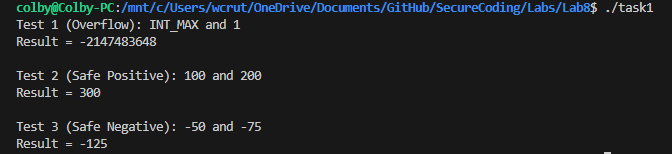
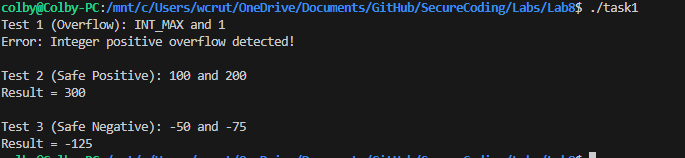

Colby Crutcher

Secure Coding

Lab 8


# Task 1

```c
void fun1 (int a, int b) { 
    int sum; 
    sum = a + b; 
    printf("Result = %d\n", sum); 
}

```

Vulnerability:

- The function adds two integers: sum = a + b. If the sum exceeds INT_MAX, it wraps around to a negative number.


Exploit:

- I chose INT_MAX because it is the largest permissible value, adding any positive integer to it guarantees the sum exceeds the storage capacity of a signed 32-bit integer, resulting in a wraparound to a negative value.

My main:

```c
int main() {
    // 1.values that cause an overflow
    printf("Test 1 (Overflow): INT_MAX and 1\n");
    fun1(INT_MAX, 1);

    // 2. Normal values that do not cause an overflow
    printf("\nTest 2 (Safe Positive): 100 and 200\n");
    fun1(100, 200);

    // 3. Normal values that do not cause an underflow
    printf("\nTest 3 (Safe Negative): -50 and -75\n");
    fun1(-50, -75);

    return 0;
}

```



Error handling:

- To handle this we can simply use conditional statements to mitigate by giving an error message. I also handled underflows, :

```c
void fun1(int a, int b) {
    // Check for positive overflow
    if ((a > 0) && (b > INT_MAX - a)) {
        printf("Error: Integer positive overflow detected!\n");
    }
    // Check for negative overflow (underflow)
    else if ((a < 0) && (b < INT_MIN - a)) {
        printf("Error: Integer negative overflow (underflow) detected!\n");
    }
    // If it passes the checks, it is safe to add
    else {
        int sum = a + b;
        printf("Result = %d\n", sum);
    }
}

```





- As shown in Figure 2, the revised function successfully intercepts the INT_MAX overflow attempt and safely processes the normal positive and negative integers without errors.


# Task 2