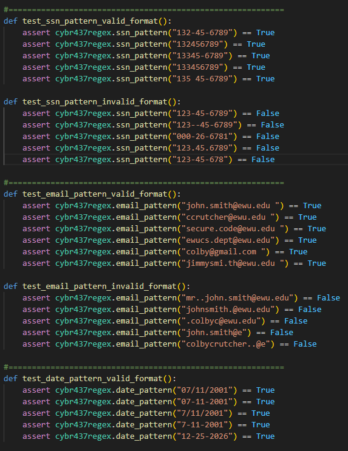
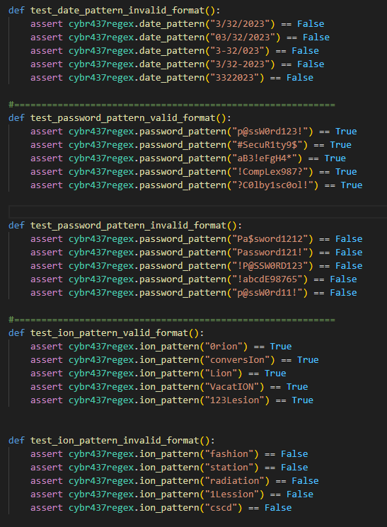
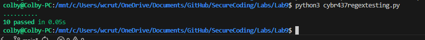

Colby Crutcher

Lab 9

Secure Coding


# Problem 1 SSN

Regex: 
```text
"^(?!([0-9])(?:[ \-]?\1){8})(?!1[ \-]?2[ \-]?3[ \-]?4[ \-]?5[ \-]?6[ \-]?7
[ \-]?8[ \-]?9)(?!9\d{2}[ \-]?[^9])(?:[189]\d{2})[ \-]?(?!00)\d{2}[ \-]?
(?!0000)\d{4}$"

```

### Explanation

```
- ^ and $: These ensure the expression evaluates the
  entire string rather than a partial match.

- (?!([0-9])(?:[ \-]?\1){8}): A negative lookahead confirming 
 that the 9 digits do not consist of 9 identical repeating digits.
- (?!1[ \-]?2[ \-]?3[ \-]?4[ \-]?5[ \-]?6[ \-]?7[ \-]?8[ \-]?9): 
  A negative lookahead making sure the digits do not run consecutively from 1 to 9.

- (?!9\d{2}[ \-]?[^9]): A negative lookahead verifying that if the SSN begins with 
  a "9", the digit in position 4 must also be a "9".
- (?:[189]\d{2}): Enforces that the SSN must begin with the digit "1", "8", or "9".
   This implicitly satisfies the rules preventing "666" in positions 1-3 and prevents 
   the first segment from being all zeros

- [ \-]?: allows an optional whitespace or dash separator strictly between places 3 and 4,
 and places 5 and 6.

- (?!00)\d{2}: negative lookahead making sure the second segment is exactly 2 
digits and is not all zeros.

- (?!0000)\d{4}: negative lookahead makes sure the third segment is exactly 
4 digits and is not all zeros. The structure of matching 3 digits, 2 digits, 
and 4 digits guarantees the SSN is exactly 9 digits long
```

# Problem 2 Email

Regex: 
```text
"^(?!.*\.\.)[^@\.]+(?:\.[^@\.]+)?@[^@]{3,}$"

```

### Explanation

```
- ^(?!.*\.\.): Negative lookahead validating that a dot is never used more
 than once consecutively anywhere in the string.

- [^@\.]+: Enforces that the string starts with characters other than an @ symbol
 or a dot. This directly satisfies the rule that a dot cannot be the character right 
 before the @ symbol.


- (?:\.[^@\.]+)?: Allows for an optional structure of a single dot followed by 
valid characters in the local prefix before the @.


- @[^@]{3,}$: Makes sure the string contains an @ symbol followed by more than 2 
characters (meaning 3 or more) until the end of the string.

```

# Problem 3 Dates

Regex:

```text
"^(?=.*?([-/]))(?:(?:0?[13578]|1[02])\1(?:0?[1-9]|[12]\d|3[01])|(?:0?[469]
|11)\1(?:0?[1-9]|[12]\d|30)|0?2\1(?:0?[1-9]|1\d|2[0-9]))\1\d{4}$"
```


### Explanation

```
- ^(?=.*?([-/])): a positive lookahead that captures the very first separator 
it finds—either a dash or a slash—into capture group 1.

- \1: This back reference dynamically expects whichever separator was captured in group 1
 to be used for the second separator. This makes it so separators cannot be mixed.

- (?:(?:0?[13578]|1[02])\1(?:0?[1-9]|[12]\d|3[01]): Matches months with 31 days
 (allowing an optional leading zero) and pairs them with valid days up to 31.

- |(?:0?[469]|11)\1(?:0?[1-9]|[12]\d|30): Matches months with 30 days and pairs them with
 valid days up to 30, preventing invalid dates like April 31st.

- |0?2\1(?:0?[1-9]|1\d|2[0-9])): Specifically handles February, only allowing days 
up to 29.

- \1\d{4}$: Follows the final separator with exactly 4 digits for the year.

```
# Problem 4 Password

Regex:

```text
"^(?!.*[a-z]{4})(?!.*(\d)\1)(?=.*[A-Z])(?=.*[a-z])(?=.*\d)
(?=.*[^a-zA-Z0-9\s])(?:[a-z]|[^a-zA-Z0-9\s]).{9,}$"
```
### Explanation

```
- ^(?!.*[a-z]{4}): A negative lookahead verifying the string does
 not have more than 3 consecutive lowercase characters.


- (?!.*(\d)\1): A negative lookahead making sure no two digits repeat
 consecutively.


- (?=.*[A-Z])(?=.*[a-z])(?=.*\d)(?=.*[^a-zA-Z0-9\s]): Four positive 
lookaheads scanning the string to guarantee the inclusion of at 
one uppercase letter, one lowercase letter, one digit, and one punctuation mark.


- (?:[a-z]|[^a-zA-Z0-9\s]): Requires the very first character of the password to
 strictly be a lowercase letter or a punctuation mark.


- .{9,}$: Accounts for the first matched character and requires at least 9 more
 trailing characters, so the total character count is at least 10.

```
# Problem 5 Ion

Regex:

```text
"(?i)^([^a-z]*[a-z][^a-z]*[a-z])*[^a-z]*[a-z][^a-z]*ion$"

```

### Explanation

```
- (?i): Enables case-insensitive matching for the entire regular expression.

- ([^a-z]*[a-z][^a-z]*[a-z])*: This group matches zero or more pairs of letters,
 ignoring any non-letters scattered around them. By grouping letters in pairs,
  it yields an even count of letters.


- [^a-z]*[a-z][^a-z]*: This section matches exactly one isolated letter
 (ignores surrounding non-letters).


- ion$: Matches the ending "ion" at the end of the string. Because 
"ion" is exactly 3 letters, combining it with the single odd letter 
from the previous group creates 4 letters. Adding this 4 to the even-numbered 
prefix pairs guarantees the total string contains an even number of letter
```
# Testing





\clearpage

# Succesful Output

