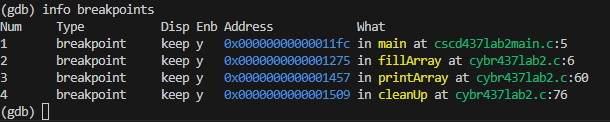
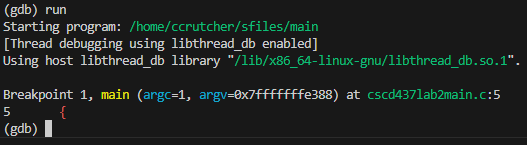
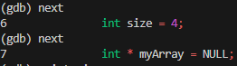
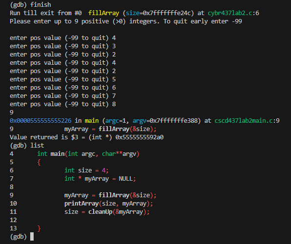
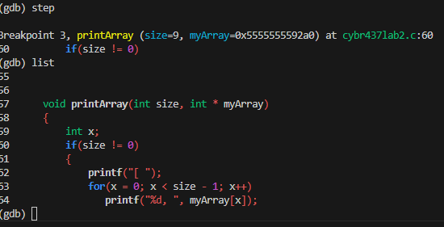
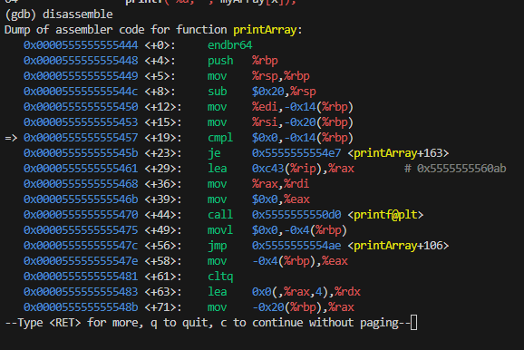
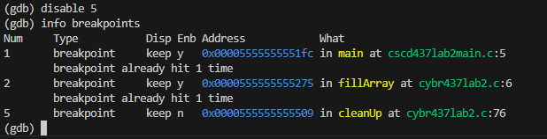
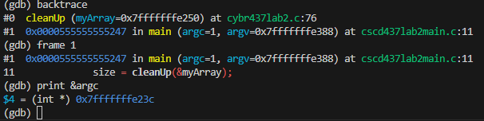
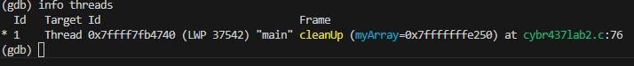
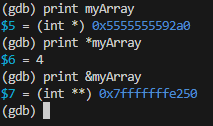

Colby Crutcher

Lab 2

Secure Coding

1. (5 points) What type of file is this, and what kind of security does it have?

- An exe file, and just has read permissions for regular users.

2. (5 points) What are the files that make up this binary, and which one contains main?

- cscd437main.c, cybr437lab2.c, cybr437.h.

cscd437main.c contains teh main function.

3. (5 points) What are the type(s) and name(s) of parameter(s) being passed to main?

- Types - int, and char pointer
- Names - int argc, and char**argv

4. (5 points) Set a breakpoint on each function and display the breakpoints.

5. (5 points) Begin running the program. How many arguments are passed to main?

- argc = 1 was passed through main, and that is it.

6. (5 points) Step twice and display the contents of the constant and two variables in main.

- int size = 4, and the int pointer myArray is null. 

7. (5 points) Step until you enter the first function called in main. What is the type and name of
the constant? Where is the constant declared?

- The constant is an int, name "MAX", and has a value of 9. It is declared globally in cybr437lab2.c

8. (5 points) Explain the difference between printing var and var[x]?

- Printing var outputs the memory address, and printing var[x] will print the actual value at index x of the array. 

9. (5 points) Instead of continuing this function, return to main and print the current line.

- I used finish to get out of fillArray, annd rant he function until it returned to main. Then I printed the current line using 'list'.

10. (5 points) Step into the second function called from main. What is the name and starting value
of the counting variable?

- The function I stepped into is printArray, and the counting variable is named x, and starts at 0.

11. (5 points) Use the disassemble command in GDB to display the assembly code for the function.
What does the output show, and how does it correlate with the C source code?

- It shows the dump and you can still see some addresses, jumps (about the extent of Assembly I know about) and the printArray function.

12. (5 points) Delete the breakpoint for the first function called in main and disable the breakpoint
for the last function called.

-  

13. (5 points) Without starting over, AKA your current location in a function that is not main, print
the memory location of the first variable passed to main.

- I was in cleanup, so I had to switch back to mains stack fram, and print the address of argc. 

14. (5 points) Print the information on the current running threads. How many threads are running?

- There is 1 thread running. 

15. (5 points) Enable the breakpoint for the third function called by main. What is the type, name,
and memory location of the variable passed to it? 

- The third function is cleanUp(&myArray). It is an int pointer. While in cleanup I printed the value using 'print myArray'.

